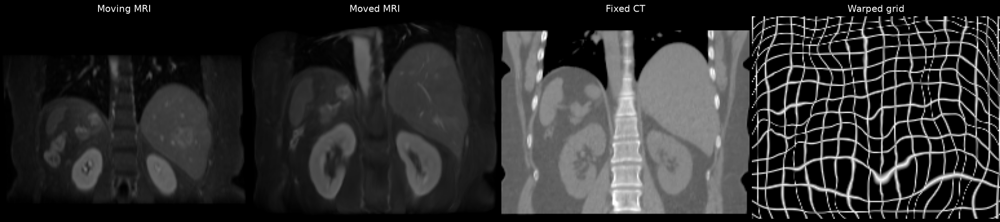
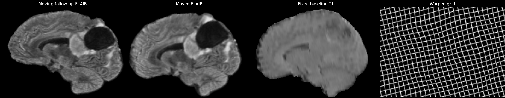

# 3D registration with anatomix + FireANTs

`anatomix-register.py` registers a moving 3D volume onto a fixed one with
[FireANTs](https://github.com/rohitrango/FireANTs), a GPU implementation of
ANTs-style rigid, affine and diffeomorphic registration. Instead of the
intensities, it registers anatomix network features (and MIND-SSC descriptors),
so it works across modalities without dataset-specific training. It supports
masks, label propagation, landmarks, initial transforms, transform export in
ANTs/SciPy/PyTorch form with inverses, and batch processing.



Tutorial notebooks:
[anatomix + FireANTs on Learn2Reg AbdomenMRCT](tutorials/anatomix_registration_fireants.ipynb) ·
[the ICLR'25 ConvexAdam pipeline](tutorials/anatomix_registration_convexadam.ipynb)

## Install registration dependencies

In your anatomix Python environment, from this directory:

```bash
bash registration_backend/install_fireants.sh   # add --no-fused-ops to skip the CUDA build
```

This clones and installs a [minimally modified fork](https://github.com/neel-dey/FireANTs)
of the FireANTs registration library into `registration_backend/fireants/`
(gitignored) and builds its CUDA kernels, which need a CUDA toolkit matching
your PyTorch build. Without the kernels FireANTs uses its slower pure-PyTorch
code.

## Usage

```bash
python anatomix-register.py --fixed fixed.nii.gz --moving moving.nii.gz --output-dir out
```

The interface is similar to the ANTs command-line tools: one flag per input,
comma-separated per-stage lists, `x`-separated pyramid schedules. Types:
`PATH` is a file, `DIR` a directory, `N` an integer, `F` a float, `A,B` one
value per stage, `AxB` one value per pyramid level.

```
Inputs (choose one mode)
  --fixed PATH, --moving PATH          One pair of scalar 3D NIfTI images.
  --fixed-dir DIR, --moving-dir DIR    Batch: directories paired by sorted filename.
  --registration-pairs-csv PATH        Batch: CSV with columns fixed,moving[,fixed_mask,moving_mask,
                                       fixed_seg,moving_seg,fixed_keypoints,moving_keypoints,initial_transform].

Optional inputs (pair mode)
  --fixed-mask PATH, --moving-mask PATH  Foreground masks (>0), on their own image's grid.
  --fixed-seg PATH, --moving-seg PATH    Integer label maps; moving labels are propagated, both give Dice.
  --fixed-keypoints PATH               CSV with x,y,z columns; the points are mapped into moving space.
  --moving-keypoints PATH              Corresponding points, row by row; gives landmark error (TRE).
  --keypoint-convention lps|ras|voxel  Coordinates of the keypoint CSVs (default lps = ITK mm).
  --initial-transform PATH             Linear transform applied first: ITK/ANTs .mat/.txt/.tfm/.h5 or FreeSurfer .lta.
  Directory batch mode takes the same inputs as directories: --fixed-mask-dir, --moving-mask-dir,
  --fixed-seg-dir, --moving-seg-dir, --fixed-keypoints-dir, --moving-keypoints-dir, --initial-transform-dir.
  CSV batch mode takes them as columns.
  --fixed-minclip F, --fixed-maxclip F, --moving-minclip F, --moving-maxclip F
                                       Intensity clipping before min-max normalization.

Transform chain
  --initialization none|image-centers|center-of-mass|moments   Closed-form start (default none).
  --transform A,B                      Stages from rigid, affine, deformable, in that order (default deformable).
  --loss A,B                           cc, mi, mse or masked_cc, masked_mi, masked_mse per stage
                                       (default masked_cc when a mask is given, else cc).
  --step-size A,B                      Learning rate per stage: of the deformation for a deformable stage, of the
                                       rotation (rigid) or linear part (affine) for a linear stage
                                       (default 1.0 deformable, 0.01 rigid/affine).
  --translation-step-size A,B          Learning rate of the translation of rigid/affine stages, in units of the
                                       fixed image's physical radius; na for deformable (default = --step-size).
  --shrink-factors AxB,AxB             Pyramid per stage, strictly decreasing (default 6x4x2x1).
  --iterations AxB,AxB                 Iterations per level (default 100 each).
  --cc-kernel-widths AxB,AxB           Odd local-CC window widths per level; na for mi/mse stages.
  --smooth-grad-sigma A,B, --smooth-warp-sigma A,B
                                       Deformable regularization in voxels (default 1.0 and 0.5); na for linear stages.
  --tolerance F                        Early-stopping tolerance on the loss slope (default 1e-6; inf disables).

Features
  --features anatomix+mindssc|anatomix|mindssc|intensity   What is registered (default anatomix+mindssc).
  --backbone anatomix|anatomix-dev|anatomix-dev-vit|custom  Network (default anatomix-dev-vit).
  --isotropic-features 0|1             Extract network/MIND features on an isotropic grid (default 1).
  --sliding-window-params W,B,O,M,S    MONAI sliding window: size, batch, overlap, mode, sigma (default 128,4,0.8,gaussian,0.25).
  --feature-normalization l2|standardized|none   Per-voxel normalization of network features (default l2).
  --mindssc-params R,D                 MIND-SSC radius and dilation (default 1,2).
  --custom-arch unet|vit, --custom-weights PATH, --unet-*, --vit-*   Own checkpoints (see --help).

Outputs
  --output-dir DIR                     Where everything is written (default .).
  --exp-name NAME                      Prefix for every output file.
  --output-transformation-convention ants|scipy|pytorch   Transform file format (default ants).
  --collapse-output-transforms 1|0     1: one final transform; 0: one cumulative snapshot per stage.
  --save-inverse                       Also write the moving-to-fixed transform and the fixed image on the moving grid.

Run control
  --device auto|cpu|cuda|cuda:N        auto picks the visible GPU with the most free memory.
  --gradient-checkpointing             Recompute the cross-correlation intermediates in the backward pass; less GPU memory.
  --seed N                             Random seed (default 12345).
  --verbose / --no-verbose             Print inputs, stage progress, metrics and peak GPU memory.
```

<details>
<summary><b>Inputs and file formats</b></summary>

Images are scalar 3D NIfTI files (`.nii`, `.nii.gz`). Fixed and moving may
differ in shape, spacing, orientation and field of view; the moving image is
resampled onto the fixed grid internally, and all transforms are defined in
physical space. Each mask or segmentation must have the shape and affine of
its own image; this is checked from the headers before anything is loaded.

Masks: positive voxels are foreground. Either mask, both, or neither may be
given. A mask multiplies the network or intensity channels, and with a
`masked_*` loss (the default when any mask is present) the loss is restricted
to the overlap of the fixed mask and the warped moving mask.

Segmentations: `--moving-seg` is propagated with nearest-neighbour sampling;
with `--fixed-seg` the mean Dice over the fixed segmentation's non-zero labels
is written to `metrics.csv`.

Keypoints: CSV files with `x,y,z` columns (other columns are kept). The
transform maps fixed points into moving space, so `--fixed-keypoints` is what
gets warped; `--moving-keypoints` are the corresponding points, row by row,
and give the landmark error. `lps` is ITK/ANTs world mm, `ras` is NIfTI/nibabel
world mm, `voxel` is the ITK continuous index.

CSV batch mode: relative paths resolve against the CSV; empty cells mean
"absent"; any other column is copied into `metrics.csv`. Directory batch mode
pairs files by sorted name, so the counts must match.
</details>

<details>
<summary><b>Stages, initialization and initial transforms</b></summary>

A run first sets a linear transform (the initialization), then runs the
`--transform` stages in order. Before every stage the original moving image
is resampled onto the fixed grid with the transform so far and its features
are extracted there; the stage then fits a residual, which is composed onto
the running transform. The original moving image and labels are resampled
only once, by the final transform.

Initializations:

- `none`: physical identity, for scans that already share a frame.
- `image-centers`: the translation that aligns the geometric centers of the
  two fields of view. Uses headers only.
- `center-of-mass`: the translation that aligns the intensity centers of
  mass, computed from the clipped, min-max normalized images inside the
  masks. Signed intensities such as CT are fine.
- `moments`: rotation and translation from second-order moments.
- `--initial-transform`: a file instead. ITK/ANTs files (`.mat`, `.txt`,
  `.tfm`, `.h5`, for example ANTs' `0GenericAffine.mat` or this tool's own
  `warp-*.mat`) map fixed to moving physical coordinates. FreeSurfer `.lta`
  files (RAS-to-RAS or vox-to-vox) map their `src` volume to their `dst`
  volume; the file's volume geometry is compared with the images to tell
  which one is `src`, and when neither matches, `src` is taken as the moving
  image, as `mri_coreg --mov moving --ref fixed` writes it. Cannot be
  combined with `--initialization`.

Rigid and affine stages optimize the rotation (or the full linear part) and
the translation as two Adam parameter groups, with `--step-size` and
`--translation-step-size`. The translation is expressed in units of the fixed
image's physical radius (the RMS half-extent of its field of view), so the
same rate works at any voxel size.

Every pyramid level is floored at 32 voxels per axis, so a multi-resolution
stage needs at least 34 voxels along every axis of both images.
</details>

<details>
<summary><b>Features</b></summary>

`anatomix+mindssc` concatenates 32 network channels and 12 MIND-SSC channels;
`anatomix` and `mindssc` use one family; `intensity` registers the clipped,
min-max normalized image itself and loads no network. Network weights download
from Hugging Face on first use. Features are extracted on an isotropic grid at
the finest spacing and resampled back; `--isotropic-features 0` extracts on
the native grid instead. `anatomix-dev-vit` requires a 128-voxel window.
</details>

<details>
<summary><b>Losses</b></summary>

`cc` is FireANTs' local normalized cross-correlation with the window widths
of `--cc-kernel-widths`; `mi` is global mutual information; `mse` is mean
squared error. The `masked_` variants restrict the loss to the mask overlap.
</details>

<details>
<summary><b>GPU memory</b></summary>

Memory grows with the number of fixed-grid voxels times the number of
channels (45 for `anatomix+mindssc` with a mask). The 192×160×192 AbdomenMRCT
pairs peak at 24 GB with the default settings and 19 GB with
`--gradient-checkpointing`. To fit large volumes: use
`--gradient-checkpointing`, stop the pyramid before full resolution
(`--shrink-factors 8x4x2`), register fewer channels (`--features anatomix`
or `intensity`), or resample the images to a coarser grid first.
</details>

## Examples

**Abdominal MRI to CT (Learn2Reg AbdomenMRCT).** One deformable stage on
masked anatomix + MIND-SSC features, with the CT clipped to [-450, 450] HU.
The registration in the figure at the top of this page:

```bash
python anatomix-register.py \
    --fixed AbdomenMRCT_0006_0001.nii.gz --moving AbdomenMRCT_0006_0000.nii.gz \
    --fixed-mask masksTr/AbdomenMRCT_0006_0001.nii.gz --moving-mask masksTr/AbdomenMRCT_0006_0000.nii.gz \
    --fixed-seg labelsTr/AbdomenMRCT_0006_0001.nii.gz --moving-seg labelsTr/AbdomenMRCT_0006_0000.nii.gz \
    --transform deformable --step-size 1.0 --shrink-factors 6x4x2x1 \
    --iterations 100x100x100x100 --cc-kernel-widths 21x13x11x9 \
    --fixed-minclip -450 --fixed-maxclip 450 --moving-minclip 0 --moving-maxclip 20000 \
    --output-dir abdomen-out
```

**Longitudinal brain scans with landmarks (BraTS-Reg).** A baseline T1 as
fixed image, a follow-up FLAIR as moving image, both skull-stripped, with
brain masks (the non-zero voxels of each image) and landmark CSVs in ITK/LPS
mm. The moved landmarks are written to a CSV and the landmark
error before and after registration to `metrics.csv`:

```bash
python anatomix-register.py \
    --fixed BraTSReg_021_00_0000_t1.nii.gz --moving BraTSReg_021_01_0214_flair.nii.gz \
    --fixed-mask BraTSReg_021_00_mask.nii.gz --moving-mask BraTSReg_021_01_mask.nii.gz \
    --fixed-keypoints BraTSReg_021_00_0000_landmarks.csv --moving-keypoints BraTSReg_021_01_0214_landmarks.csv \
    --keypoint-convention lps \
    --transform deformable --step-size 0.1 --shrink-factors 4x2x1 \
    --iterations 200x100x50 --cc-kernel-widths 7x5x3 --output-dir brain-out
```

**Affine then deformable.** For pairs that start tens of millimeters apart,
an affine stage before the deformable one. Per-stage flags take one entry per
stage; `na` marks entries that do not apply to a stage. The figure below is
case 127 of BraTS-Reg, whose median landmark error goes from 19.2 mm to
1.9 mm:

```bash
python anatomix-register.py \
    --fixed BraTSReg_127_00_0000_t1.nii.gz --moving BraTSReg_127_01_0148_flair.nii.gz \
    --fixed-mask BraTSReg_127_00_mask.nii.gz --moving-mask BraTSReg_127_01_mask.nii.gz \
    --fixed-keypoints BraTSReg_127_00_0000_landmarks.csv --moving-keypoints BraTSReg_127_01_0148_landmarks.csv \
    --transform affine,deformable --step-size 0.01,0.1 \
    --shrink-factors 4x2x1,4x2x1 --iterations 100x100x100,200x100x50 \
    --cc-kernel-widths 9x7x5,7x5x3 --smooth-grad-sigma na,1.0 --smooth-warp-sigma na,0.5 \
    --save-inverse --output-dir brain-out
```



**Rigid or affine only.** A rigid stage with separate rotation and
translation learning rates, exported as an ITK `.mat`:

```bash
python anatomix-register.py --fixed fixed.nii.gz --moving moving.nii.gz \
    --initialization center-of-mass \
    --transform rigid --step-size 0.01 --translation-step-size 0.05 \
    --shrink-factors 4x2x1 --iterations 100x100x100 --cc-kernel-widths 9x7x5 \
    --output-dir rigid-out
```

**Intensity-based registration.** The classic baseline, without any
network: affine then deformable on the clipped intensities with mutual
information:

```bash
python anatomix-register.py --fixed fixed.nii.gz --moving moving.nii.gz \
    --features intensity --loss mi,mi \
    --transform affine,deformable --step-size 0.01,0.1 \
    --shrink-factors 4x2x1,4x2x1 --iterations 100x100x100,200x100x50 \
    --cc-kernel-widths na,na --smooth-grad-sigma na,1.0 --smooth-warp-sigma na,0.5 \
    --output-dir intensity-out
```

**Starting from an existing transform.** A deformable stage on top of a
linear transform computed elsewhere, here a FreeSurfer `mri_coreg` result
(an ANTs `0GenericAffine.mat` or this tool's own `warp-*.mat` work the same
way):

```bash
mri_coreg --mov moving.nii.gz --ref fixed.nii.gz --reg coreg.lta
python anatomix-register.py --fixed fixed.nii.gz --moving moving.nii.gz \
    --initial-transform coreg.lta \
    --transform deformable --step-size 0.1 --shrink-factors 4x2x1 \
    --iterations 200x100x50 --cc-kernel-widths 7x5x3 --output-dir deformable-out
```

**Batch from a CSV.** One row per pair; optional columns may be empty.
`metrics.csv` gets one row per pair, with any extra input columns copied
over:

```bash
cat > pairs.csv <<'CSV'
case,fixed,moving,fixed_mask,moving_mask,fixed_seg,moving_seg
0001,imagesTr/AbdomenMRCT_0001_0001.nii.gz,imagesTr/AbdomenMRCT_0001_0000.nii.gz,masksTr/AbdomenMRCT_0001_0001.nii.gz,masksTr/AbdomenMRCT_0001_0000.nii.gz,labelsTr/AbdomenMRCT_0001_0001.nii.gz,labelsTr/AbdomenMRCT_0001_0000.nii.gz
0002,imagesTr/AbdomenMRCT_0002_0001.nii.gz,imagesTr/AbdomenMRCT_0002_0000.nii.gz,masksTr/AbdomenMRCT_0002_0001.nii.gz,masksTr/AbdomenMRCT_0002_0000.nii.gz,labelsTr/AbdomenMRCT_0002_0001.nii.gz,labelsTr/AbdomenMRCT_0002_0000.nii.gz
CSV
python anatomix-register.py --registration-pairs-csv pairs.csv \
    --transform deformable --step-size 1.0 --shrink-factors 6x4x2x1 \
    --iterations 100x100x100x100 --cc-kernel-widths 21x13x11x9 \
    --fixed-minclip -450 --fixed-maxclip 450 --moving-minclip 0 --moving-maxclip 20000 \
    --output-dir batch-out
```

**Large volumes on a small GPU.** Gradient checkpointing, a pyramid that
stops at half resolution, and one sliding window at a time:

```bash
python anatomix-register.py --fixed fixed.nii.gz --moving moving.nii.gz \
    --initialization image-centers \
    --transform rigid,deformable --step-size 0.01,1.0 \
    --shrink-factors 8x4x2,8x4x2 --iterations 100x100x100,100x100x100 \
    --cc-kernel-widths 15x11x9,15x11x9 --smooth-grad-sigma na,1.0 --smooth-warp-sigma na,0.5 \
    --gradient-checkpointing --sliding-window-params 128,1,0.8,gaussian,0.25 \
    --output-dir large-out
```

## Reproducing our Learn2Reg AbdomenMRCT results

The dataset (8 subjects, abdominal MRI and CT with organ labels and
foreground masks) is available from the
[Learn2Reg AbdomenMRCT](https://cloud.imi.uni-luebeck.de/s/yiQZfo43YBBg7zL/download/AbdomenMRCT.zip)
challenge. MRI (`_0000`) is registered to CT (`_0001`). Both rows are the
mean and median over the eight pairs.

| Pipeline | Mean Dice | Median Dice | Folds |
|---|---|---|---|
| anatomix + FireANTs (this script, `anatomix-dev-vit` features) | 0.879 | 0.892 | 0 |
| anatomix + ConvexAdam (ICLR'25 paper, `anatomix` features) | 0.756 | 0.854 | — |

**anatomix + FireANTs.** The batch command below, or the
[notebook](tutorials/anatomix_registration_fireants.ipynb), which also
downloads the data. `pairs.csv` lists the eight pairs as in the batch example
above.

```bash
python anatomix-register.py --registration-pairs-csv pairs.csv \
    --features anatomix+mindssc --backbone anatomix-dev-vit \
    --transform deformable --loss masked_cc --step-size 1.0 \
    --shrink-factors 6x4x2x1 --iterations 100x100x100x100 --cc-kernel-widths 21x13x11x9 \
    --fixed-minclip -450 --fixed-maxclip 450 --moving-minclip 0 --moving-maxclip 20000 \
    --output-dir abdomen-fireants
```

**anatomix + ConvexAdam (ICLR'25).** The paper's pipeline is kept under
[`registration_backend/convexadam/`](registration_backend/convexadam/) and
needs no FireANTs installation. Its
[notebook](tutorials/anatomix_registration_convexadam.ipynb) runs all eight
pairs; for one pair from the command line:

```bash
python registration_backend/convexadam/run_convex_adam_with_network_feats.py \
    --hf_variant anatomix --exp_name demo --result_path abdomen-convexadam \
    --fixed imagesTr/AbdomenMRCT_0001_0001.nii.gz --moving imagesTr/AbdomenMRCT_0001_0000.nii.gz \
    --use_mask --path_mask_fixed masksTr/AbdomenMRCT_0001_0001.nii.gz --path_mask_moving masksTr/AbdomenMRCT_0001_0000.nii.gz \
    --warp_seg --path_seg_fixed labelsTr/AbdomenMRCT_0001_0001.nii.gz --path_seg_moving labelsTr/AbdomenMRCT_0001_0000.nii.gz \
    --fixed_minclip -450 --fixed_maxclip 450
```

## Outputs

Files use the moving filename stem, prefixed by `--exp-name` when given:

| File | Contents |
|---|---|
| `moved-*.nii.gz` | Moving image on the fixed grid (trilinear). |
| `moved-seg-*.nii.gz` | Propagated labels (nearest neighbour). |
| `moved-keypoints-*.csv` | Fixed landmarks mapped into moving space. |
| `warp-*` | The fixed-to-moving transform (see Warp conventions). |
| `inverse-warp-*`, `inverse-moved-*` | With `--save-inverse`: the moving-to-fixed transform on the moving grid, and the fixed image (and segmentation) resampled onto the moving grid. |
| `metrics.csv` | Input columns plus `dice`, `num_folds`, `tre_median`, `tre_mean`, `tre_initial_median`, `robustness` (fraction of landmarks whose error decreased) and `inverse_residual_mm`; one row per pair, written as each pair completes. |

`num_folds` counts fixed-grid voxels (excluding a one-voxel border) whose
physical Jacobian determinant is not positive. `inverse_residual_mm` is the
largest inverse-consistency error of the numerical inverse inside the fixed
field of view.

## Warp conventions

All `warp-*` transforms map **fixed coordinates to moving coordinates**, the
direction that resamples the moving image onto the fixed grid, as in ANTs.

- `ants` (default): a linear `.mat` for rigid/affine chains, otherwise an ITK
  displacement field `.nii.gz` in LPS mm. Apply with

  ```bash
  antsApplyTransforms -d 3 -i moving.nii.gz -r fixed.nii.gz -t warp-moving.nii.gz -o out.nii.gz
  ```

  (`-n NearestNeighbor` for labels).
- `pytorch`: a `.pt` sampling grid of shape `(1,Z,Y,X,3)` holding normalized
  moving coordinates for `torch.nn.functional.grid_sample(...,
  align_corners=True)`. nibabel loads volumes as `(X,Y,Z)`; transpose them to
  `(Z,Y,X)` before sampling.
- `scipy`: `.npz` with `arr_0` of shape `(X,Y,Z,3)` such that
  `moving_index = fixed_index + arr_0`, for `scipy.ndimage.map_coordinates`;
  linear-only chains store `affine`, the physical LPS-mm fixed-to-moving
  matrix, instead.

`--save-inverse` writes the moving-to-fixed transform in the same format on
the moving grid (`inverse-warp-*`); dense inverses are computed numerically.
`--collapse-output-transforms 0` writes one cumulative snapshot per stage
(`warp-*-init`, `warp-*-0-affine`, `warp-*-1-deformable`, ...); each
snapshot is a complete transform and must not be composed with the others.

## Credits and license

Registration is performed by **FireANTs**
([repository](https://github.com/rohitrango/FireANTs),
[documentation](https://fireants.readthedocs.io/en/latest/)) through
[a minimally modified fork](https://github.com/neel-dey/FireANTs), which has
its own license. If you use this backend in a paper, please cite anatomix and
FireANTs:

```bibtex
@inproceedings{dey2025learning,
  title={Learning general-purpose biomedical volume representations using randomized synthesis},
  author={Dey, Neel and Billot, Benjamin and Wong, Hallee and Wang, Clinton and Ren, Mengwei and Grant, Ellen and Dalca, Adrian and Golland, Polina},
  booktitle={International Conference on Learning Representations},
  volume={2025},
  pages={32033--32064},
  year={2025}
}
@article{jena2024fireants,
  title={FireANTs: Adaptive Riemannian Optimization for Multi-Scale Diffeomorphic Registration},
  author={Jena, Rohit and Chaudhari, Pratik and Gee, James C},
  journal={Nature Communications},
  year={2024}
}
@inproceedings{jena2025scalable,
  title={A Scalable Distributed Framework for Multimodal GigaVoxel Image Registration},
  author={Jena, Rohit and Zope, Vedant and Chaudhari, Pratik and Gee, James C},
  booktitle={The Fourteenth International Conference on Learning Representations},
  year={2026}
}
```

MIND-SSC follows Heinrich et al., MICCAI 2013. The ConvexAdam backend is a
modified fork of the
[ConvexAdam repository](https://github.com/multimodallearning/convexAdam);
if you use it in a paper, please cite ConvexAdam as well:

```bibtex
@article{siebert2024convexadam,
  title={Convexadam: Self-configuring dual-optimization-based 3d multitask medical image registration},
  author={Siebert, Hanna and Gro{\ss}br{\"o}hmer, Christoph and Hansen, Lasse and Heinrich, Mattias P},
  journal={IEEE Transactions on Medical Imaging},
  volume={44},
  number={2},
  pages={738--748},
  year={2024},
  publisher={IEEE}
}
```
